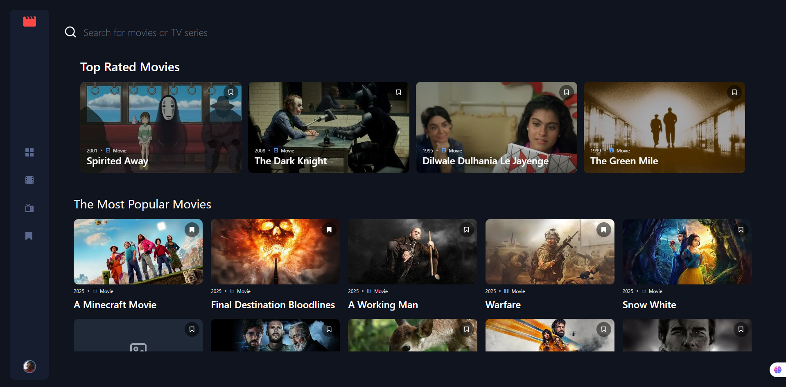
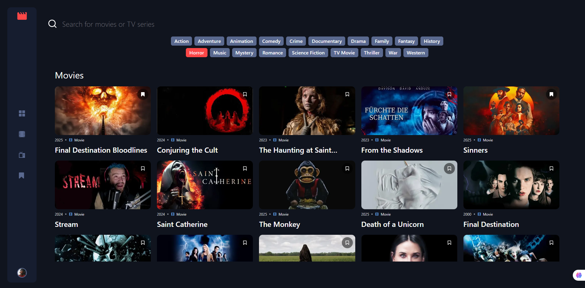
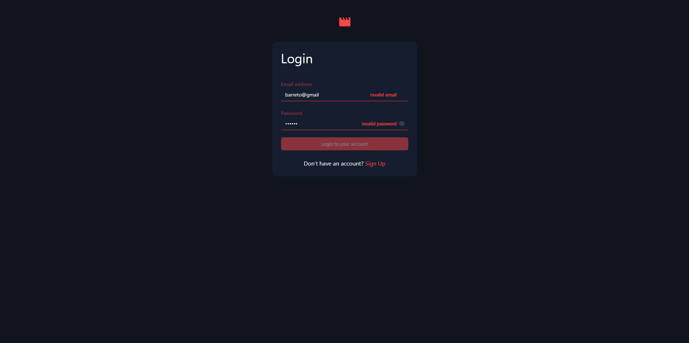
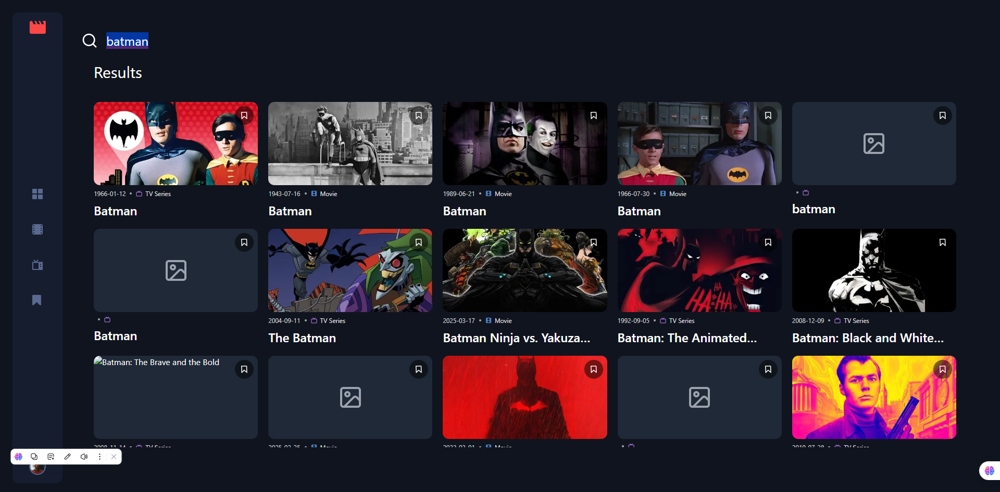

# 🎬 Movie App

**Movie App** es una aplicación web que permite explorar y visualizar películas o series utilizando la API de [TMDB](https://www.themoviedb.org/). Podés descubrir tendencias, buscar contenidos por nombre o categoría, y si te registrás, podrás guardar tus favoritas o armar una lista personalizada de títulos que querés ver.

## 🌐 Demo online

👉 [https://moviescope-6uerdxj53-jamesbarr456s-projects.vercel.app/home](https://moviescope-6uerdxj53-jamesbarr456s-projects.vercel.app/home)

## 🛠️ Tecnologías utilizadas

- **Next.js 15+**
- **Tailwind CSS**
- **ShadCn/UI**
- **Axios**
- **Firebase** (autenticación y base de datos)
- **TMDB API**

---

## 🚀 Instalación y ejecución

1. **Cloná el repositorio:**

   ```bash
   git clone https://github.com/JamesBarr456/app-tmdb
   cd app-tmdb
   ```

2. **Instalá las dependencias:**

   ```bash
   npm install
   ```

3. **Configurá las variables de entorno:**  
   Creá un archivo `.env.local` en la raíz del proyecto y agregá lo siguiente con tus propias claves de acceso:

   ```env
   # --------------------------
   # VARIABLES PÚBLICAS (CLIENTE)
   # --------------------------

   # TMDB API
   TMDB_API_TOKEN="TU_TOKEN_TMDB"

   # Firebase config (frontend SDK)
   NEXT_PUBLIC_FIREBASE_API_KEY="TU_API_KEY"
   NEXT_PUBLIC_FIREBASE_AUTH_DOMAIN="TU_AUTH_DOMAIN"
   NEXT_PUBLIC_FIREBASE_STORAGE_BUCKET="TU_STORAGE_BUCKET"
   NEXT_PUBLIC_FIREBASE_MESSAGING_SENDER_ID="TU_SENDER_ID"
   NEXT_PUBLIC_FIREBASE_APP_ID="TU_APP_ID"
   NEXT_PUBLIC_FIREBASE_MEASUREMENT_ID="TU_MEASUREMENT_ID"

   # --------------------------
   # VARIABLES PRIVADAS (BACKEND)
   # --------------------------

   # Firebase Admin SDK (solo backend)
   FIREBASE_PRIVATE_KEY="TU_PRIVATE_KEY"
   FIREBASE_CLIENT_EMAIL="TU_CLIENT_EMAIL"
   FIREBASE_PROJECT_ID="TU_PROJECT_ID"
   ```

4. **Ejecutá el proyecto en desarrollo:**

   ```bash
   npm run dev
   ```

---

## ✨ Características principales

- 🔍 **Buscador general** de películas y series por nombre.
- 🎯 **Filtrado por categorías** para contenido de tipo `movie` o `tv`.
- 🔐 **Sistema de autenticación** y **registro de usuarios** con Firebase.
- 🛡️ **Protección de rutas** utilizando middleware de Next.js y verificación de tokens con el SDK Admin de Firebase.
- ❤️ **Sistema de favoritos** personalizado (disponible solo con sesión activa).
- ⭐ **Listas personalizadas** de títulos para ver más tarde.

---

## 📸 Capturas

1. 
2. 
3. 
4. 
5. 

---

## 👤 Autor

**Barreto Santiago Emmanuel**  
👤 [LinkedIn](https://www.linkedin.com/in/santiago-emmanuel-barreto/)

📁 [Repositorio GitHub](https://github.com/JamesBarr456/app-tmdb)
